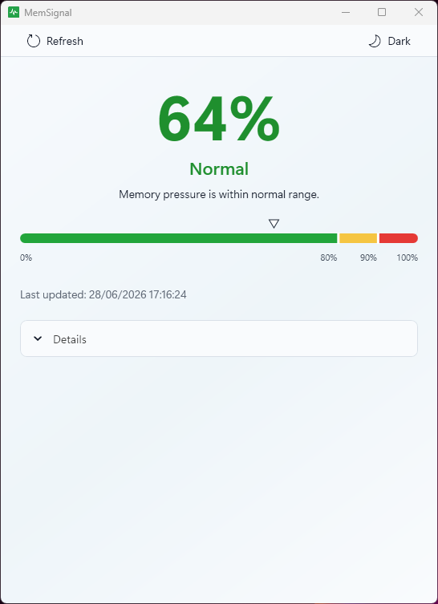
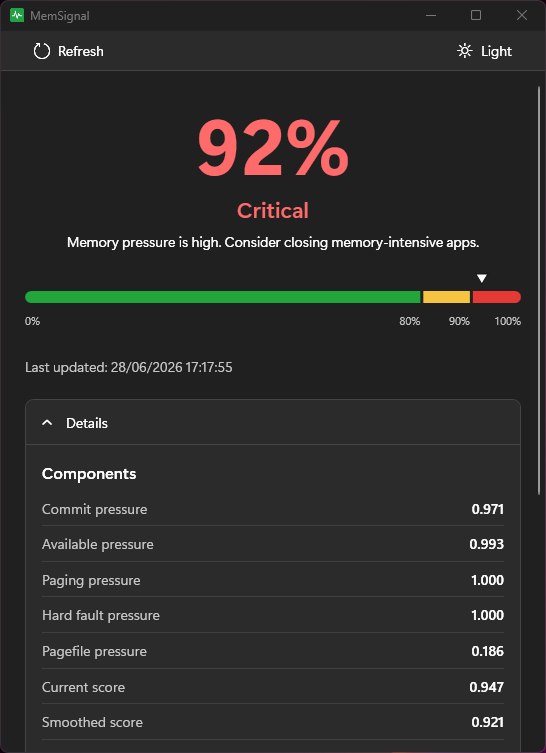

# MemSignal

**An experimental memory-pressure signal for Windows.**

MemSignal is a small project built out of curiosity, inspired by the concept of memory pressure in macOS: high RAM usage does not always mean that a system is under pressure, so could Windows expose a more useful signal at a glance?

MemSignal combines several Windows memory metrics into an approximate memory-pressure estimate and keeps the current state visible in the system tray.

  
  

## 📥 Download

Windows x64 executables are available on the [Releases page](https://github.com/riccardoruspoli/MemSignal/releases/latest):

- **Standalone** (`MemSignal-Windows-x64-standalone.exe`) includes the .NET runtime and is the simplest option.
- **Framework-dependent** (`MemSignal-Windows-x64.exe`) is smaller but requires the [.NET 10 Desktop Runtime](https://dotnet.microsoft.com/download/dotnet/10.0/runtime) to be installed.

The executables are currently unsigned, so Microsoft Defender SmartScreen may show a warning.

## 🧭 What it shows

MemSignal considers committed memory, available physical memory, paging activity, hard page reads, and pagefile usage when available. It reports an estimated pressure percentage together with a **Normal**, **Warning**, or **Critical** state.

The Details panel exposes the values behind the estimate.

## 🧮 How the estimate works

Each available metric is normalized to a value between `0` and `1`, where higher values indicate greater pressure. The normalized values are combined using fixed weights, then smoothed over time to reduce short-lived jumps.

The final value is displayed as a percentage from `0%` to `100%`. This percentage is a normalized score, not the amount of RAM in use or a probability that the system will run out of memory.

## 🖥️ Requirements and current scope

MemSignal is an experimental personal project for Windows x64. It has currently been tested on one Windows 11 system with 16 GB of RAM and a system-managed pagefile. Behavior on other Windows versions and hardware configurations has not yet been validated.

## 🔒 Privacy and system behavior

MemSignal reads aggregate memory metrics locally through Windows APIs. It does not collect data or transmit it over the network.

Closing or minimizing the window keeps MemSignal running in the system tray. A notification explains this the first time it happens. To stop the application, use **Exit** from the tray menu.

## 📄 License

MemSignal is available under the [MIT License](LICENSE).
